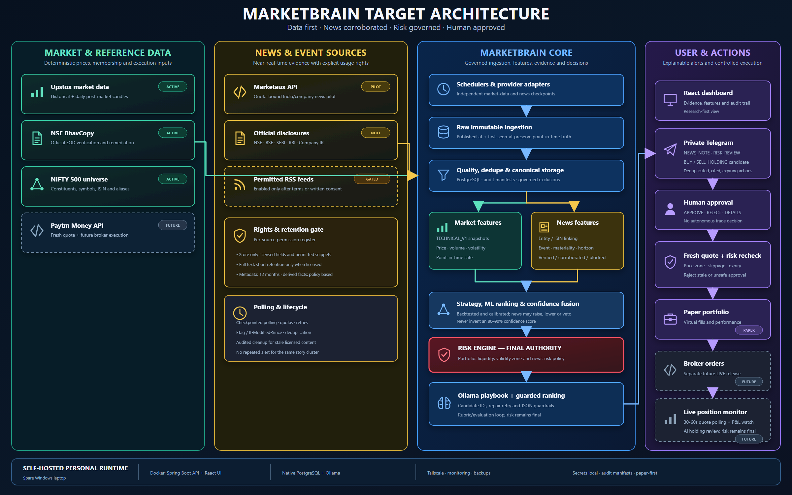

# MarketBrain

MarketBrain is a personal, self-hosted Indian-market research and paper-trading platform.



## Current phase

Phase 1 establishes the data-first foundation. It is deliberately paper-only:

- real market data may be collected and analysed;
- all portfolios and fills are virtual in `PAPER` mode;
- the risk engine must approve every actionable signal;
- no broker order placement is implemented;
- Telegram remains disabled until a private bot token and local pairing code are configured.
- the optional WhatsApp Cloud API channel can mirror the exact same system-notification text through an independently
  idempotent sandbox delivery checkpoint; Meta's 24-hour free-form conversation rule still applies.

The reviewed NIFTY 500 historical foundation is complete, provider-audited, and backed up. Governed daily enrichment provides a read-only per-instrument freshness preview, deterministic reviewed manifest, bounded catch-up protection, resumable incremental jobs, and a post-market scheduler. Once explicitly activated, it silently probes Upstox's current-day intraday daily endpoint from 16:00 India time and starts only after the target date is available, retrying every 15 minutes through 17:45 with one final attempt at 18:00. The worker combines the intraday target candle with historical catch-up dates under the same validation and normalization rules. It never rewrites review decisions and sends one private, action-free completion through every enabled notification channel immediately after success or one warning only after the final 18:00 attempt fails. Transient connectivity/provider outages pause safely with persisted 1, 5, and 15 minute backoff and automatic continuation.

The next data-first layer computes point-in-time technical features. It selects one canonical daily candle per date
and prefers reviewed official NSE BhavCopy remediation when both data sources contain that date. It removes governed
feature-exclusion windows and calculates deterministic features using only observations at or before the requested
date. The full 500-instrument result is bound to an immutable SHA-256 manifest.

Once activated, a durable post-collection scheduler repeats the reviewed daily handoff gates, persists or reuses the
exact immutable snapshot, verifies it independently, and sends one identical private conclusion through Telegram and
the optional WhatsApp mirror. Incomplete or
unverifiable data remains non-actionable. Feature persistence cannot create signals, orders, or broker actions.

The first strategy-data increment is a read-only swing-training cohort preview. It keeps `TECHNICAL_V1` inputs at
an explicit as-of date separate from 5, 20, and 60-session future outcomes, costs, excursions, drawdown, and an
equal-weight benchmark proxy. Current constituents are not treated as historical membership: survivor bias is
reported explicitly and keeps the preview ineligible for model training until date-effective membership is added.

The next governed boundary accepts an authorized, date-effective NIFTY 500 membership CSV only through a
hash-locked read-only preview. It verifies interval integrity, exactly 500 active members on the requested date,
current and historical ISIN matching, and a deterministic manifest. Public current-constituent files are never
invented into historical membership; persistence and model training remain separately disabled.

While that authorized dataset is pending, the news-intelligence track starts with a read-only source-permission
register. Every API, RSS feed, and official disclosure source records its evidence state and remains disabled until
explicit usage rights have been reviewed. Pending correspondence cannot grant storage or local-AI rights, and the
permission preview cannot fetch news, write data, call Ollama, create a feature, or create a signal or order.

If licensed historical NIFTY 500 membership remains unavailable, MarketBrain can use a separate read-only fallback
preview over currently active NSE instruments that already have governed daily candles. This fallback is useful for
prototype training-dataset work, but it is not historical NIFTY 500 membership and it retains an explicit
current-universe survivorship-risk warning until delisted historical equities are added.

The first fallback training artifact is an immutable prototype swing dataset. It persists the exact reviewed
current-snapshot feature/label manifest for prototype learning while keeping official historical benchmark training,
Ollama training, signals, fills, and broker orders disabled.

The next review layer audits that immutable prototype dataset without writing data. It reports label coverage,
return distribution, benchmark excess, drawdown/excursion behavior, and best/worst examples before any Ollama-assisted
ranking experiment is allowed.

The first Ollama step is a governed ranking preview. It sends a bounded set of audited feature rows to local Ollama,
keeps future labels outside the prompt for later comparison, and returns a review artifact only. It cannot create
signals, fills, orders, or broker actions.

## Repository layout

| Path | Purpose |
| --- | --- |
| `marketbrain-service` | Spring Boot modular-monolith backend, database migrations, data-provider contracts, and risk/audit foundation. |
| `marketbrain-ui` | React and TypeScript dashboard with a persistent PAPER MODE indicator. |
| `compose.yaml` | Local container topology. PostgreSQL and Ollama remain native Windows services for this installation. |
| `docs` | Product and operating decisions that guide future implementation. |

## Local prerequisites

- Java 21 or newer
- Maven 3.9 or newer
- Node.js 22 or newer
- PostgreSQL 18 running locally with the `marketbrain` database

The backend reads database credentials only from environment variables. Never commit credentials, Telegram bot tokens,
WhatsApp tokens or secrets, Analytics Tokens, Paytm tokens, or broker passwords.

For Upstox and Paytm Money feasibility details and the Nifty 500 import format, see [data-provider-feasibility.md](docs/data-provider-feasibility.md).

For the approved target design covering Marketaux, permission-gated RSS feeds, official events, retention, confidence fusion, Ollama explanation, risk controls, and Telegram outcomes, see [news-intelligence-design.md](docs/news-intelligence-design.md). The editable diagram source is [marketbrain-architecture.svg](docs/marketbrain-architecture.svg).

For daily build, deployment, verification, and troubleshooting commands, use [daily-runbook.md](docs/daily-runbook.md).

For the isolated Meta-provided test-number boundary, see [whatsapp-sandbox.md](docs/whatsapp-sandbox.md).

## Run locally

Backend:

```powershell
cd marketbrain-service
$env:MARKETBRAIN_DB_URL = 'jdbc:postgresql://127.0.0.1:5432/marketbrain'
$env:MARKETBRAIN_DB_USERNAME = 'marketbrain_app'
$env:MARKETBRAIN_DB_PASSWORD = '<your local password>'
mvn spring-boot:run
```

Dashboard:

```powershell
cd marketbrain-ui
npm install
npm run dev
```

Open `http://127.0.0.1:5173`. The dashboard is intentionally a PAPER MODE shell until the data and paper-trading workflows are connected.
