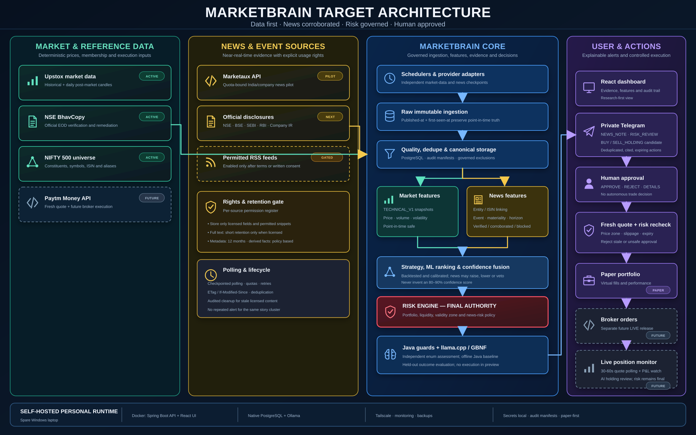

# System and INR 100,000 paper-portal design

Design baseline MB-PLAN-2026-09-18-V2, aligned to the accepted parent goals. Scope and progress: [roadmap](roadmap.md). Implementation evidence: [register](evidence-register.md). **This document specifies future work; it does not claim the portal or numerical predictor is already built.**

PG1 is the full intelligence/eventual approved-execution platform. PG2 is its mandatory paper-first deployment, using shared contracts rather than a simplified parallel product. Autonomous collection/analysis is permitted only within authorized operations; autonomous unapproved trading is not part of these goals. Owner acceptance of this documentation does not enable code changes or real orders.

## Responsibility and execution boundary

| Component | Owns | Must not do |
|---|---|---|
| Provider adapters | Authorized data retrieval, timestamps, instrument identity, provenance and feed health | Silently invent missing prices, mix sources or place orders |
| Java data layer | Calculated indicators, point-in-time features, quality checks and reproducible snapshots | Pass future outcomes to inference |
| Historical/fundamental data layer | Frequency-specific history coverage, membership, financial publications and revisions | Fabricate pre-listing data or expose a later restatement to an earlier prediction |
| Numerical prediction engine | Horizon-specific expected outcomes, risk estimates and validated probabilities where available | Treat a language-model score as calibrated probability |
| Governed learning workflow | Separate preference/outcome evidence, drift detection, evaluated challengers and controlled promotion | Treat ACCEPT as a correct prediction or silently mutate an active trial model |
| Optional small language model | Evidence-grounded news/entity/event extraction and compact typed interpretation | Override risk, execute arbitrary tools or act as an unvalidated price predictor |
| Java decision/risk policy | Turn forecasts into BUY/SELL/HOLD/NO_TRADE proposals subject to position, cost, liquidity and risk rules | Convert a forecast directly into a broker transaction |
| Human approval | Accept or reject eligible, expiring proposals | Bypass fresh quote/risk validation through late approval |
| Paper execution and ledger | Simulated order/fill lifecycle, shared cash and positions, charges, reconciliation | Send create/modify/cancel orders to Paytm or Upstox |
| Portal and notifications | Explainable evidence, Java-templated alerts, approval and audit views | Present paper results as guaranteed live returns |

`HOLD` applies to an existing position and creates no order. `NO_TRADE`/`ABSTAIN` covers no eligible new action, unavailable inputs or insufficient confidence. Existing research labels such as REJECT/WATCHLIST/SHORTLIST/TOP_PICK are not broker order instructions. User-facing Telegram and portal actions are **ACCEPT / REJECT**; an ACCEPT event can still end in risk rejection, expiry or no fill after revalidation.

## Target flow

1. Upstox and, when authorized/implemented, Paytm supply market data. Marketaux supplies news under its subscription rights.
2. Java persists source events and availability times, resolves identities and updates versioned snapshots/bars.
3. A scheduled interval or a relevant new story triggers a bounded reassessment. News is matched to eligible Nifty 500 companies; ambiguous matches enter review, not automatic decisioning.
4. The numerical model estimates each supported horizon; Java checks input quality, risk, costs and current positions, then persists a proposal or abstention.
5. The portal/private Telegram receives a Java-templated proposal with timestamp, reference price, permitted zone, quantity/risk, expiry and concise reason codes.
6. Approval causes fresh quote, position and risk revalidation. Only then may the paper engine accept and simulate an order. Every state change is auditable and idempotent.

Live data can arrive frequently without running a language model on every tick for all 500 stocks. Proposed scheduling is minute-bar numerical reassessment, bounded news-triggered reassessment and end-of-day swing updates. Tune these intervals against measured capacity and the intended horizon. Random sampling is useful for evaluation coverage, not as the sole mechanism for risk monitoring. Local language-model concurrency remains 1.

## Provider contracts

### Upstox: existing foundation plus a separate streaming goal

Source already includes instrument import, full quotes, historical/intraday candles and corporate actions. Daily enrichment is a scheduled post-market pipeline. Neither proves that an intraday WebSocket pipeline exists.

The official [V3 market-feed documentation](https://upstox.com/developer/api-documentation/v3/get-market-data-feed/) describes the streaming/protobuf interface; account-specific subscription limits and permissions must be verified before implementation. [Analytics-token documentation](https://upstox.com/developer/api-documentation/analytics-token/) describes a read-only access option; verify its actual availability and coverage for this account. Do not infer current deployment configuration from these product capabilities.

### Paytm: read-only market data now, execution later

The existing client fetches historical price charts. G05 adds live data; G12 alone covers future real orders. Consult the [official developer portal](https://developer.paytmmoney.com/) and current account-specific documentation/support for endpoint contracts, authentication, rate limits, instruments and feed permissions. Public landing pages are not sufficient to implement authentication safely.

Earlier project correspondence recorded a public static outbound/egress-IP prerequisite. Treat that as a prerequisite to reconfirm against the actual enabled API product. A LAN or Tailscale address is not a public static egress address. Do not provision infrastructure or change network routing merely because this design names it.

### Shared live-data envelope

Required fields: provider, exchange/instrument identifier, canonical ISIN where available, symbol mapping version, event time, received time, exchange session, price/quantity units, bid/ask when available, sequence identifier when available and quality flags. Preserve raw provenance and corrected/revised event relationships.

Define a primary source and explicit freshness/quality-based failover. Never silently average conflicting quotes. Divergence beyond a predeclared tolerance raises an alarm and may stop the affected decisions. Reconnection requires gap assessment and safe bar backfill. Rate limits, entitlement, trading halts, price bands and unavailable depth remain visible limitations.

### Marketaux and optional language-model extraction

The [official documentation](https://www.marketaux.com/documentation) describes news and entity fields. Entitlement to obtain a response is not automatically permission to retain full articles indefinitely. Record subscription rights, retention and attribution requirements first.

Persist publication and first-seen timestamps separately, provider IDs, permitted text, entity-match evidence, event categories, correction links and duplicate clusters. Treat article text as untrusted data, never operational instructions. Reject unsupported extraction claims; store evidence spans and uncertainty. Language-model outages or schema failures must not create arbitrary replacement values. Test namesakes, subsidiaries, multiple companies, rumours, repeated stories, stale stories and prompt-injection content.

## Numerical prediction engine: build order and contract

The existing indicator/ranking heuristics and language-model sweeps are evaluation infrastructure, not a fitted numerical predictor. Java alignment measures agreement with a rule baseline, not future market correctness. Repeated prompting does not train model weights.

### Historical coverage and fundamental evidence (G13/G14)

The target is 15+ years of daily price/volume history for eligible instruments that existed during that period, and since listing for newer companies. Maintain both today's Nifty 500 universe and historical constituent snapshots for historical evaluation. Delistings, membership changes, renamed symbols, mergers, splits and dividends require explicit identity/action records. Unavailable history is a reported gap, not permission to fabricate data or claim full coverage.

Maintain a coverage matrix by instrument, field, frequency, date, provider and licence. Daily, minute/tick, news and fundamental histories have separate acquisition/retention requirements; this plan does not promise 15 years of tick data or news from a provider without evidence. Freeze required depth and acceptable exclusions per advertised mode. Full-history acceptance requires G13 evidence; limited pilots must state the actual limitations.

Fundamental features cover reporting periods, earnings/growth, profitability, cash flow, leverage, share counts and valuation inputs. Preserve standalone/consolidated distinctions and currency/unit normalization. Store reporting period end, publication time, first-seen time and restatement/version separately: period end is not when the information became knowable. Do not retrospectively replace historical inputs with revised financial statements. Stale/missing and sector-inapplicable ratios remain explicit.

Test calculations and time-aware joins before feature evaluation. Compare models with and without fundamentals and news against the same dates, costs and risk rules; more features do not automatically mean better prediction. Acquisition sources and rights must be verified, not inferred from an existing price-feed integration.

### Lookback, forecast and evaluation horizons

Required multi-session forecasts are **5/20/60 trading sessions**, with the 20-session baseline implemented first. Historical 5/20/60-session diagnostics/lookbacks are distinct from forward outcome labels. Store `lookbackSessions` (or a feature-window set), `forecastHorizon`, `horizonUnit` and decision/entry timestamps separately. All historical features stop at the decision's information cutoff; forward labels are evaluation-only.

Intraday forecasts initially target 30/60 minutes within a trading session and require their own data, labels and costs. Multi-session history may inform intraday features but a 5-session forecast is not an intraday trade. Ten-session forecasting remains optional and cannot replace the required 60-session target. Each advertised horizon needs independent acceptance evidence.

### First target: 20-session swing research

Implementation boundary (E28/E29): the existing aggregate audit is reviewed, not a prediction-grade dataset. `NumericalDataContract.draft()` exposes a versioned, non-training-authorized contract. The new read-only history endpoint/collector provides paged window coverage and persisted exclusion reasons, not model predictions or regenerated labels. Its [N2 work package](numerical-baseline-plan.md#n2-implementation-and-spare-laptop-handoff) defines the proposed 16:00 cutoff, feature formulas, remaining policy gates and query limits. Runtime evidence and contract freeze precede multi-date export. Pages are not an atomic cross-page data snapshot; late ingestion alone cannot establish historical data unavailability.

- Form an end-of-day snapshot using only information available at that decision timestamp.
- First research label convention: next eligible session's open as entry, that entry session counts as session 1, exit at the close of session 20. Missing/invalid executable prices invalidate or explicitly censor the label; they are not replaced with a future convenient price.
- Include versioned estimated round-trip costs/slippage. This research label is distinct from an actual paper fill, which occurs only after approval at an eligible subsequent price.
- Predict net forward return initially; add separately validated downside/event probabilities if they improve the declared objective. Do not advertise an uncalibrated model score as a probability.
- Candidate inputs: point-in-time price/volume changes over required 5/20/60-session lookbacks (optional additional windows), trend, volatility, liquidity, sector/benchmark context, validated fundamentals and permitted news features. Existing feature calculators provide some, not all, of these.
- Preserve corporate-action treatment, market calendar, historical constituent membership and data vintage. If historical membership is unavailable, disclose survivorship bias and limit conclusions.

### Training and validation workflow

Existing Upstox quality work is a reusable foundation (E31), not invalidated by retrospective ingestion. Candle source and validation provenance are distinct. The proposed research mode must disclose backfilled/revised prices and current-membership bias; live/as-known replay needs actual availability evidence. Neither mode admits future labels/news as features. A pure next-open/session-20 outcome calculator now exists and is tested, but is not wired into export or an endpoint (E32). It does not certify caller-supplied calendar, executable prices or policy identifiers. See the [reuse policy and bounded handoff](numerical-baseline-plan.md#reuse-validated-history-distinguish-research-availability-from-live-availability).

1. Build reproducible multi-date feature/label manifests. Fit transformations on training data only.
2. Compare a deterministic baseline, a simple linear learner and a bounded small tree-model candidate. Offline Python training is a proposed implementation choice, not an installed capability.
3. Use chronological train/tuning/untouched-final partitions. Purge observations whose outcome windows overlap the next partition; group evaluation by decision date to avoid treating correlated stocks as independent trials.
4. Freeze feature definitions, costs, search budget and the primary metric before final evaluation. Preserve failed configurations. Do not repeatedly reuse the final holdout as a tuning set.
5. Evaluate net return, downside, drawdown, turnover, opportunity coverage, calibration if relevant, and consistency across dates/sectors/regimes. Compare paired predictions under identical execution/risk assumptions. Estimate uncertainty using time-aware/date-block methods; do not infer confidence from four examples.
6. Choose a deployable inference format only after numerical parity, feature ordering and missing-value tests pass. Java inference through a validated export is preferred; the exact runtime is an implementation decision, not a dependency already present.
7. Version model artifact, feature schema, training span, dataset hash, metrics, limitations and rollback target. A failed or inconclusive challenger does not replace the baseline.

Add required 5/60-session swing and 30/60-minute intraday models as separate validated targets. Intraday needs adequate point-in-time bars/quotes, session boundaries and realistic spread/liquidity assumptions. Twenty-session performance cannot establish intraday or 60-session performance. News/fundamental feature ablation must show whether those inputs add value beyond prices/volume.

### Proposed internal forecast contract

At minimum: prediction ID, instrument, decision/availability timestamps, horizon, feature version, model version, data-quality status, predicted net return, risk estimate, calibration version if applicable, reason codes and abstention reason. Future outcome labels exist only in the evaluation store. A forecast must not contain executable credentials or an unchecked tool name.

The Java policy consumes this contract plus actual account state. Changes in forecast do not silently alter a held position; proposed changes are governed by approval/protective rules defined before use.

### Feedback, market outcomes and controlled learning (G15)

Persist three distinct evidence families: (1) ACCEPT/REJECT/expiry, optional user reasons and constraints; (2) horizon-specific forecast outcomes whether or not the user accepted; (3) execution/portfolio outcomes, including fill timing, costs and risk effects. User acceptance is not a correctness label, and rejection is not evidence that the forecast was bad. Keep preference personalization separate from financial prediction objectives.

Distinguish observed market outcomes, approved paper fills, research-simulation fills and eventual broker fills. Hypothetical results must carry their assumptions and cannot masquerade as actual returns. Do not evaluate only the proposals that were accepted; record coverage, abstentions and selection bias. Every outcome links to its original decision, input snapshot, horizon and model/policy version.

Collect feedback continuously, but retrain only on eligible mature labels using a declared cadence or drift trigger. A retraining run produces a challenger, not an automatic active-model update. Evaluate it against frozen baselines, untouched temporal tests, cost sensitivity, calibration and risk gates. Promotion requires recorded acceptance; maintain rollback and immutable experiment history. Freeze model/policy cohorts during prospective trials; material changes start a new cohort rather than rewriting past decisions. Improvement is an objective to measure, not a guarantee on each cycle.

## Paper portal design

Initial instrument scope: proposed **long-only NSE cash equities**. Short selling, leverage, derivatives and automatic averaging are outside the initial design and require explicit expansion.

### Screens and user actions

| Screen | Required content/actions |
|---|---|
| Overview | Prominent PAPER badge; INR 100,000 initial equity; available/reserved cash; holdings value; realised/unrealised P&L; fees; drawdown; last reconciliation |
| Universe and feed health | Nifty 500 membership version, source coverage/freshness, stale/gapped symbols, provider health and last successful update |
| Opportunities | Separate intraday/swing tabs; BUY/SELL/HOLD/NO_TRADE; distinct historical lookback and forecast horizon, input age, expected outcome/risk, expiry and reason codes |
| Decision evidence | Indicator snapshot, news provenance, model/policy versions, baseline comparison and why a proposal passed or failed risk |
| Approval queue | ACCEPT / REJECT, quantity and permitted price zone; expiry and fresh-revalidation result; no live-order button |
| Orders and fills | Proposed/accepted/pending/partial/filled/cancelled/expired states, simulated fill assumptions, idempotency/audit references |
| Positions | Held/reserved quantity, average price, valuation source/time, horizon, stop/exit proposals and realised/unrealised costs |
| Evaluation and reports | Frozen cohort metrics, all failures/abstentions, fundamental/news ablations, feedback versus outcomes, baseline comparison, timing and separate paper/research reports |
| Integrations and operations | Redacted provider status, queue lag, backup/restore status, active model/policy and operator pause; secrets never displayed |

The existing static dashboard is a starting point, not this completed portal. Daily goal completion initially lives in Markdown; a portal roadmap screen is optional later, not a second independent source of truth.

### Account and ledger invariants

- One virtual account starts at **INR 100,000**, shared across intraday and swing. Separate allocations cannot double-spend the same cash.
- Use integer paise or explicitly rounded decimal money, not binary floating-point ledger balances. Append auditable postings for funding, reservations, fills, charges, sales and corporate actions.
- Available cash = ledger cash minus outstanding reservations. Reserve atomically; reconcile positions and cash against fills. A SELL requires sufficient unreserved holdings.
- No silent cash reset or top-up during a trial. A reset opens a new identifiable trial/account. Benchmark portfolios are separate analytical accounts, not extra capital for the main account.
- Position valuations carry source and time. Stale prices are labelled and cannot make new risk checks appear current.

### Approved portfolio versus research simulation

Only accepted, revalidated BUY/SELL proposals can affect the approved INR 100,000 account. HOLD and NO_TRADE/ABSTAIN create assessment records, not orders. A separate research engine may simulate rejected/unapproved recommendations and alternative configurations using versioned capital/fill assumptions. It must have isolated account/run IDs, reservations, ledger, reports and an explicit RESEARCH SIMULATION label. It cannot spend approved-account cash, send approval callbacks or route broker orders.

Use the research stream to compare selection effects and hypothetical outcomes, not to inflate the approved account's reported performance. No silently optimistic fill rule or hindsight-selected entry is permitted. Track features/strategies as frozen experiments and preserve losing trials.

### Shared paper/live contracts, separate execution adapters

The production-intended path shares instrument/data envelopes, feature/model contracts, policy/risk checks, proposals, ACCEPT/REJECT events and validated order intents with paper mode. The paper adapter simulates fills; the future separately authorized Paytm adapter communicates with the broker and reconciles broker-owned state. Both map to the same audited lifecycle contract, but fills/latency/liquidity cannot be assumed identical.

Contract tests must cover duplicate approvals, partial fills, expiry, rejection, cancellation, restart and uncertain order status. In the paper release, assert that no broker create/modify/cancel request is dispatched. Mock conformance tests are not proof of actual broker integration. The later live release needs independent authentication, permissions, reconciliation, live-position monitoring and protective-action tests; it is not enabled through a single mode switch.

### Proposal and order lifecycle

Proposals: `PROPOSED → APPROVED / REJECTED / EXPIRED`. The user-facing ACCEPT action maps to the internal APPROVED state; existing enum names need not be confused with display text. No code/enum migration is performed by this documentation change.

Approved proposals: `REVALIDATING → PAPER_ORDER_ACCEPTED / RISK_BLOCKED`.

Paper orders: `PENDING → PARTIALLY_FILLED → FILLED`, with cancellation/expiry paths and auditable terminal reasons. Exact persistence migrations and transition constraints must be designed/tested before implementation; current SQL tables do not imply all these states exist.

Approvals should support approximately two minutes of human reading time **only where the horizon and permitted price zone make that safe**. Each proposal states its own timestamp, expiry, reference price, maximum slippage and acceptable zone. Revalidate the current quote, market session, cash, holdings, data freshness and risk after approval. An expired/out-of-zone BUY is rejected, not chased. Intraday may need a shorter validity window, determined by validation.

Approval tokens are opaque, single-use, expiring and bound to the specific proposal/policy. Portal and Telegram share one transaction/idempotency boundary. Duplicate delivery or clicks must not create multiple orders. Java templates provide readable alerts without relying on model prose.

### Conservative simulation, not optimistic fills

Use eligible post-approval market observations, bid/ask where available and explicit adverse slippage/cost assumptions. Last traded price alone is not a guaranteed fill. Limit-price touch does not guarantee quantity execution. Respect price bands, market hours, volume/participation limits and configured liquidity constraints; support partial fills and expiry.

If required quote/depth evidence is unavailable, either reject simulation or mark a preapproved conservative approximation clearly. Version charge/fee estimates and settlement/corporate-action assumptions. Intraday square-off and overnight handling are predeclared policies, not opportunistic decisions after observing outcomes.

### Proposed risk defaults — owner approval required

These are engineering test limits, not financial advice or promises of safety:

- Maximum planned loss per new position: 1% of current paper equity.
- Maximum single-company notional exposure: 20% of current paper equity.
- Aggregate planned open-position risk: 3%; no leverage or negative available cash.
- Daily loss threshold: 2% pauses new entries; portfolio drawdown threshold: 8% pauses the strategy for review.
- A stop-based planned loss is not a guaranteed maximum loss; gaps/illiquidity can exceed it. Simulate that risk honestly.

All limits must be approved/versioned before the trial; runtime switches cannot silently loosen them. Protective actions in the paper engine must follow a preapproved policy and remain audited.

## Operations, security and evidence

Private access and operator identity must be verified before exposing approval endpoints. Tailscale/private access is the starting access boundary to review; it does not replace application authorization, session protection or TLS where required. Do not open public ports as a side effect of this documentation.

Telegram is the intended durable unattended approval channel. WhatsApp sandbox capability is not production readiness; production setup/template permissions require separate evidence. WhatsApp failure must not block or duplicate Telegram. Secrets stay outside Git, responses, screenshots and exported evidence.

Persist input references, decision/approval/order state transitions, raw permitted model outputs, validation failures, timings and revision/config hashes incrementally. Unique run IDs prevent file collisions. Recovery must distinguish completed, interrupted and resumable work; never label an old result as a new success. Proposed user handoff: **one compact summary JSON and one readable log**, with an optional single ZIP containing full redacted evidence. Internal durability must not be reduced to achieve fewer shared files.

Measure ingestion lag, queue depth, data age, feature/inference/approval/fill latency, p50/p95/max durations, retry causes, cache effectiveness, invalid/abstained decisions and restart recovery. Missing outputs and denominator changes remain visible. A health endpoint being UP does not prove feed or model readiness.

No real order adapter is wired into this release. A separate future release must explicitly authorize broker execution, permissions, order reconciliation, failure handling and protective controls; it cannot be enabled just by changing PAPER to LIVE.

## Trial entry and exit

E40 adds a read-only quality/price evidence endpoint scoped to selected immutable-run instruments and the saved feature period. It links stored job/chunk membership, corporate-action facts and latest resolution/revocation state; it never adjusts candles or grants training permission. Completed scheduling coverage and prior saved-report references are distinct from fresh quality certification, and absence of corporate-action records remains UNKNOWN. Caps, current-ledger limitations and missing provenance are explicit. Price-policy approval and label-period coverage require subsequent evidence review.

E41 confirms that endpoint on spare. E42 is an offline coordinated preflight over saved feature/price reports: exact scope/hash binding, typed feature allowlist/trailing input references, availability disclosures, 20-session path/indicative arithmetic and date-grouped candidate split purging. It never turns stored-price arithmetic into executable labels, never trains, and cannot approve unknown price provenance. Current three-date fixtures yield four overlapping training rows and eight unavailable label ends; a broader immutable dataset and frozen folds remain required. The one-file review requires no running service or deployment.

E43 verifies that preflight on spare. E44 adds an outcome-only read bounded to <=4 selected stocks and as-of+1..as-of+45 days, also capped by stored label-through; same transaction reads extended quality/action evidence. Original feature inputs remain frozen. The client joins future bars only for diagnostic outcome paths against a separate reviewed calendar extension, checkpoints one response for offline reuse, and retains price-policy/training gates. No model or labels are promoted from path completeness; mixed collection vintages are disclosed. Read-only SQL, timeouts/caps and no new migration/config preserve deployment scope.

Numerical dataset preparation includes a bounded, read-only multi-date feature snapshot (`NumericalFeatureSnapshotService`, E36/E37). It reuses stored candles and the existing technical calculator, with source evidence and explicit cutoff/blocked-row checks. E38's offline reviewer independently matches the saved 12 feature windows to a bounded NSE circular-backed session calendar; it does not alter the original observed-bar output or establish broad calendar/price certification. Research remains retrospective, not as-known replay, and contains no labels or training authorization. See [the numerical work package](numerical-baseline-plan.md) for exact definitions, limits and remaining gates. Its source evidence envelope is not a model input DTO.

Enter only after the advertised data feeds, horizons, paper lifecycle, approval and recovery gates pass. A limited-mode trial may start earlier only with explicit owner approval and disabled/unvalidated modes clearly excluded; it does not complete the full G11 goal.

Run at least 30 elapsed calendar days and 20 actual trading sessions, with sufficient observations and complete outcome maturation. The operational month milestone does not complete 60-session prediction validation: final predictions require their full 60-trading-session window from the defined entry. A restricted earlier pilot must explicitly exclude unvalidated horizons and incomplete history/fundamental/learning scope; it cannot claim full PG2 acceptance.

Freeze model/policy cohorts; retain failed runs. Review numerical value separately from uptime, formatting and accounting correctness. Paper simulation cannot establish actual market impact, broker execution reliability or future profitability. G12 remains a distinct decision even after a successful paper trial.
